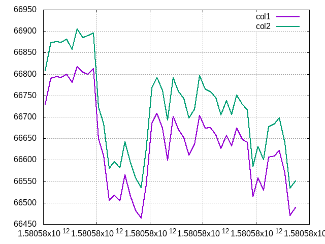

# Cryzzly
[](https://github.com/franciscoGPS/cryzzly/releases)


Crystal library for data analysis.
Inspired by [Pandas](https://pandas.pydata.org/)


## Installation

1. Add the dependency to your `shard.yml`:

   ```yaml
   dependencies:
     cryzzly:
       github: franciscoGPS/cryzzly
   ```

2. Run `shards install`

## Usage


```crystal
require "cryzzly"


# Load CSV file 
df = DataFrame(Any).load_data("my_csv.csv", index_col: 0, index_type: "datetime" )

# From matrix array
df = Dataframe(Float64).new([[1,2,3], [4,5,6]], ["col_1","col_2","col_3"])


# Return headers list
df.headers

# Sum of specified column keys
df.sum("col_1","col_2", "col_3")

# Mean of specified column keys
df.mean("col_1","col_2", "col_3")

# Amount of columns 
df.length

# Shape of dataset
df.shape

# Minimum value of specified column keys 
df.min("col_1","col_2", "col_3")  
 
# Maximum value of specified column keys
df.max("col_1","col_2", "col_3")
 
# Standard deviation
df.std("col_1","col_2", "col_3")

# Uses Aquaplot to plot files. Stored on specified location

df.plot("col_1","col_2", filename: "my_plot")
## Output "Image stored in: my_plot.png"


df.to_csv("col_1","col_2", "col_3", filename: "my_csv")
## Output "File stored in: my_csv.csv"


```
<p align="center">
  
</p>

## TODO:

### String and timestamp column analysis 
  - [] count
  - [] unique
  - [] top
  - [] freq

## Contributing

1. Fork it (<https://github.com/your-github-user/cryzzly/fork>)
2. Create your feature branch (`git checkout -b my-new-feature`)
3. Commit your changes (`git commit -am 'Add some feature'`)
4. Push to the branch (`git push origin my-new-feature`)
5. Create a new Pull Request

## Contributors

- [Francisco C.](https://github.com/franciscoGPS) - Creator and maintainer


